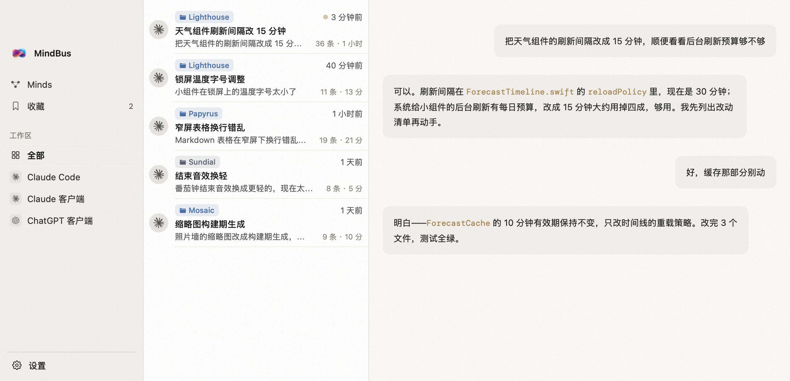

<div align="center">


# MindBus

**Every conversation you have with AI, collected on one machine.**

The models are rented; the conversations are yours.

Runs entirely on your Mac · No account · No networking code in this repo (only Sparkle's update check, one click to turn off)

[](LICENSE)
[](#installation)
[](Package.swift)
[-1a1a1a?style=flat-square)](Package.swift)
[](https://github.com/BaoWeiiii/mindbus/actions/workflows/ci.yml)
[](https://github.com/BaoWeiiii/mindbus/releases/latest)

[](#)
[](README.md)

[Installation](#installation) · [Sources](#supported-sources) · [Privacy](#privacy) · [Development](#development)

</div>

---

## What it is

**A memory box for your AI tools.**

Browse and star your history anytime — and let any AI tool tap into it, retrieving past context at minimal token cost.



One box, two customers: **you**, and **your AI**. Every pain it cures is a concrete one —

### For you

**① "Gone before I even noticed."**
Claude Code silently deletes all history after 30 days — official policy, with reports of deletion even after changing the setting. Everyone who lasts 30 days will one day find their records gone, unrecoverably.
→ **Kept for good**: every conversation gets a compressed local copy. The tool deletes its own; yours stays. The app shows how many conversations have outlived those 30 days — and how many were rescued by that copy.

**② "I know we talked about it. I just can't find it."**
Three tools, three formats, three directories buried under `~/`. Finding last week's decision means digging one by one.
→ **One window for everything**: search in Chinese or English straight to the message, filter by tool / project / time.

**③ "I dare not close this window — let alone start a new chat."**
This session holds a whole afternoon of context. Close it and it might be lost; start fresh and you re-explain everything. So the window stays open, forever, untouchable.
→ **Close it freely**: conversations live in the box for good — browse back anytime, star what matters, or **relay** any selection into a new chat. Context follows you, not the window.

**④ "I have no idea how many times I've said the same thing."**
You have your own go-to phrases — they roll off your tongue; your briefings to AI repeat themselves too. These patterns are invisible to yourself.
→ **Minds makes them visible**: counted from your own conversations — the verbs you delegate with, your catchphrases, the exact briefings you keep repeating (how many times, across how many sessions). That sentence you keep saying? Time to make it a template.


### For your AI

**⑤ "Every session is a first encounter."**
Each new chat starts from zero: decisions made, dead ends explored, preferences agreed — all gone, and you explain again.
→ **Built-in read-only MCP**: any connected AI can search this full history and read your profile — picking up where you left off instead of meeting you for the first time, every time.

**⑥ "One touch of history, a pile of tokens."**
To give AI your history today, you either inject whole conversations (hundreds of thousands of tokens) or gamble on keyword search and pay for the misses.
→ **The [Memory Transit Protocol](docs/MEMORY-TRANSIT.md)**: hand the AI a 1.5K-token map first, let it decide whether and where, then drill down layer by layer — ~4K tokens end to end, any conversation reachable within three transfers. No direct route promised; arrival guaranteed.

All of this happens on your machine. This repo contains no networking code; the only network call is Sparkle's update check — on by default (every 24 hours it fetches the appcast on GitHub and verifies its EdDSA signature), one click to turn off in Settings.

## Supported AI tools

The app reads exactly these three locations, read-only, never modifying originals:

| Source | Path |
| --- | --- |
| Claude Code | `~/.claude/projects/**/*.jsonl` |
| Claude desktop (local Agent mode) | `~/Library/Application Support/Claude/local-agent-mode-sessions/` |
| Codex (shown in the app as "ChatGPT Desktop") | `~/.codex/sessions/**/*.jsonl` |

The Codex row covers sessions written to `~/.codex/sessions` by Codex CLI and by the "Codex" mode of the ChatGPT desktop app — not ChatGPT web chats.

> Note: you need to have used at least one of these — MindBus collects conversations you already have. No history, empty box.

Parsers for Cursor, OpenClaw, and GitHub Copilot are in the repo but not yet enabled — they need more real-world samples to validate. Contributions welcome.

## Under the hood

Three technical baselines, one for each word of the positioning:

**"Your" — data never leaves your machine.** This repo contains no networking code. Verify it yourself:

```bash
grep -rn "URLSession\|URLRequest" MindBus/
```

**No output.** No accounts, no crash reporting, no analytics. Parsing and indexing happen locally; the index is a SQLite file on your disk. The only network feature is Sparkle's update check: on by default, once every 24 hours it fetches the appcast on GitHub and verifies its EdDSA signature; turn it off with one click in Settings. The networking lives inside the Sparkle framework, not in this repo.

**"Browse anytime" — a local full-text engine.** BM25 with dual tokenizers (Chinese and English each get their own), a personal lexicon learned from your own corpus, query expansion, and project-context weighting. Minds is zero-LLM throughout — every line traces back to counts, dates, conversations.

**"Minimal token cost" — the [Memory Transit Protocol](docs/MEMORY-TRANSIT.md).** A five-step disclosure ladder (map → line → search → digest → original), token bill published; the structural path is capped at three hops, 100% reachable, independent of retrieval luck.

## How to use

### As a person

Open the app; it scans automatically and the list is ready in seconds:

- **Search**: Chinese or English keywords, highlighted hits, click to jump to the message.
- **Browse**: filter by tool / project / time; project color tags; a gold breathing dot marks active conversations.
- **Star & relay**: star key messages; "relay copy" carries selected content into any new chat.
- **Minds**: your own portrait — phrases you repeat, verbs you delegate with, catchphrases, activity heatmaps.

### As an AI

Two sentences. First, tell your AI:

> Register `/Applications/MindBus.app/Contents/MacOS/mindbus-mcp` as an MCP server named mindbus

It configures itself. Second, add to your `CLAUDE.md` (or `AGENTS.md`):

> When past decisions, project history, or "previously / last time" come up, search the original conversations with mindbus's memory_search first; before starting a new task, read my preferences with minds_read.

All five tools (memory_search / memory_browse / memory_open / memory_digest / minds_read) are read-only — the index opens read-only and cannot be modified. The only thing the MCP process writes is an append-only usage log at `~/Library/Application Support/MindBus/mcp-refs.jsonl` (conversation id, timestamp, host name — no message text). Also worth knowing: any connected agent that calls `memory_browse()` with no arguments gets the whole library's project-path map and top entities — that is by design.

## Install

Download `MindBus-x.y.z.dmg` from [Releases](https://github.com/BaoWeiiii/mindbus/releases/latest) (universal for Apple Silicon and Intel), drag into Applications. The DMG is signed with an Apple Developer ID and notarized — it opens with a double-click.

Or build from source:

```bash
git clone https://github.com/BaoWeiiii/mindbus.git
cd mindbus
swift build -c release
./scripts/build-release.sh        # packages MindBus.app (add --dmg for a DMG)
```

Requires Xcode 15+ / Swift 5.9+, macOS 13.0 or later.

## Development

```
MindBus/
├── Core/          # MindBusCore — parsing and indexing, pure logic, independently testable
│   ├── Loaders/   # per-tool JSONL parsers
│   ├── DB/        # incremental SQLite index
│   ├── Markdown/  # body segmentation and code block detection
│   └── Models/    # Conversation / Message / ContentBlock
├── Views/         # SwiftUI interface (menu bar panel / browser / settings)
└── Config/        # design tokens, bilingual strings table, Sparkle updates
```

All parsing lives in the `MindBusCore` library target, which doesn't depend on SwiftUI and can be tested without the UI:

```bash
swift test          # 900+ tests — all green is the bar for merging
```

Adding a new source is usually one Loader plus a test suite — see [`CodexLoader.swift`](MindBus/Core/Loaders/CodexLoader.swift) for reference.

## FAQ

**The app is empty?**
MindBus collects conversations you already have. No uploads, no cloud — use Claude Code / Claude desktop / Codex at least once first.

**Does deleting a conversation touch the original file?**
Never. Deletion only removes it from MindBus (list, search, Minds, archived copy). Every deletion test asserts the source file is still on disk.

**Is Minds AI-generated?**
No. Every line is counted from your own conversations — zero LLM. MCP's `minds_read` only hands that profile to the AI as-is; no tool can write into it.

## Contributing

Issues and PRs welcome, in English or Chinese:

- **All tests green is the bar** — run `swift test` before submitting; parser or index changes need accompanying tests.
- **New conversation sources** are the most wanted contribution: one Loader + tests plugs into the whole pipeline. See [`CodexLoader.swift`](MindBus/Core/Loaders/CodexLoader.swift).
- **Zero external dependencies** is a project invariant (Sparkle is the sole exception) — open an Issue before introducing any.
- After cloning, run `scripts/setup-hooks.sh` to install the commit guard; see [CONTRIBUTING.md](CONTRIBUTING.md) for the rest.

## Uninstall

Data sovereignty includes leaving cleanly. Everything MindBus writes to your disk, item by item:

| Location | Contents |
| --- | --- |
| `/Applications/MindBus.app` | The app itself (including `mindbus-mcp`) |
| `~/Library/Application Support/MindBus/` | The index `index.sqlite` (rebuildable from source files anytime) and the MCP usage log `mcp-refs.jsonl` |
| `~/.mindbus/` | **This is your archive**: compressed copies of every conversation, the Minds profile `minds.md`, and your stars / aliases / deletion records. Conversations the tools themselves have deleted survive only here — think before removing it |
| `~/Library/Preferences/ai.mindbus.app.plist` | Preferences and update settings |
| `~/Library/Caches/ai.mindbus.app/` | System cache |
| Login item | Toggle in Settings from 1.4.1; or System Settings → General → Login Items |

[`scripts/uninstall.sh`](scripts/uninstall.sh) in the repo quits the app first, prints every item above and asks before deleting, with a separate second confirmation for `~/.mindbus`. By hand:

```bash
osascript -e 'tell application "MindBus" to quit'
rm -rf /Applications/MindBus.app
rm -rf ~/Library/Application\ Support/MindBus
rm -rf ~/Library/Caches/ai.mindbus.app
defaults delete ai.mindbus.app
rm -rf ~/.mindbus                                 # your archive copy — only once you're sure
```

Older versions (≤ 1.4.0) wrote a Native Messaging manifest into Chromium-based browsers; 1.4.1 removes it automatically on first launch. To clean up by hand, delete this file wherever it exists (`<browser>` is one of `Google/Chrome`, `Arc/User Data`, `Microsoft Edge`, `BraveSoftware/Brave-Browser`, `com.operasoftware.Opera`, `Chromium`):

```
~/Library/Application Support/<browser>/NativeMessagingHosts/com.mindbus.native.json
```

Your original transcripts (`~/.claude` etc.) were never modified — uninstalling doesn't affect them.

## License

[MIT](LICENSE)
