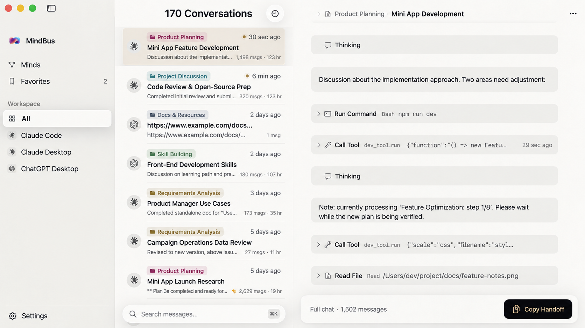
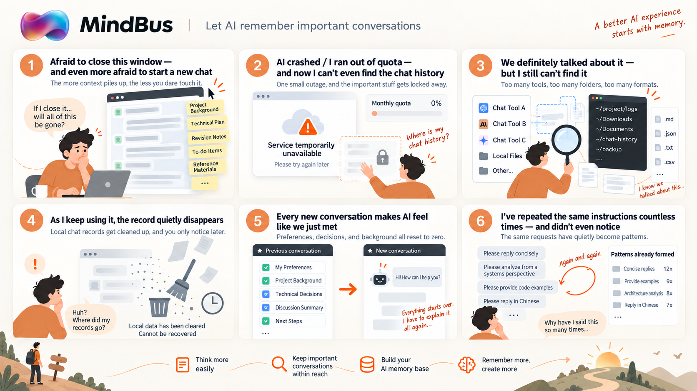
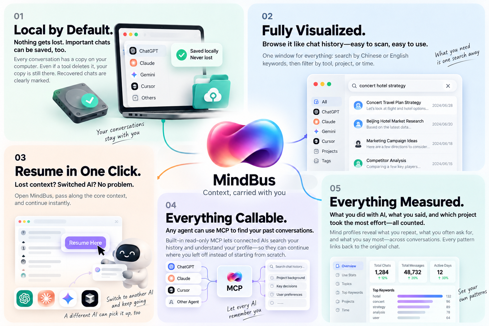

<div align="center">


# MindBus

**Every conversation you have with AI, collected on one machine.**

The models are rented; the conversations are yours.

[](LICENSE)
[](#install)
[](Package.swift)
[](https://github.com/BaoWeiiii/mindbus/releases/latest)

Language: English | [简体中文](README.md)

[What it is](#1-what-it-is) · [Why I built it](#2-why-i-built-it) · [What it does](#3-what-it-does) · [Quick start](#4-quick-start)

</div>

---

## 1. What it is

**A memory box for your AI tools.**

MindBus is a macOS app that collects your conversations from Claude Code, Claude Desktop, and ChatGPT Desktop into one window. Browse, star, and search them anytime, and relay any selection into a new chat with one click. Your AI can query the same history through MCP. Everything stays on your own Mac.

<p align="center"></p>

## 2. Why I built it

I talk to several AI tools every day. The more I used them, the more these things bothered me:

<p align="center"></p>

1. **I'm afraid to close this window, and even more afraid to start a new chat.**

   This session holds a whole afternoon of context. Close it and it might be gone; start fresh and I have to explain everything again. So the window stays open, and the longer it stays, the less I dare touch it.

2. **The AI went down or I ran out of quota, and I can't even get to my chat history.**

   One outage or an exhausted quota, and whatever I was working on is locked inside a window that won't open.

3. **I know we talked about it, but I can't find it.**

   Three tools, three formats, three folders buried somewhere under `~/`. Finding last week's decision means digging through them one by one.

4. **The records quietly disappear.**

   Some tools clean up local history on a schedule. By the time I go looking, it's gone, with no warning.

5. **Every new conversation starts as a first meeting.**

   Decisions made, dead ends explored, preferences agreed on: all reset to zero, and I explain them all over again.

6. **I've repeated the same instructions countless times without noticing.**

   I have my own go-to phrases, and my requests to AI keep recurring. These patterns are invisible from the inside.

So I built MindBus: every conversation collected on one machine, for me to browse anytime and for my AI to look up anytime.

## 3. What it does

<p align="center"></p>

| Feature | What it means |
| --- | --- |
| **Kept for good**<br><sub><em>Local by default</em></sub> | Every conversation gets a copy on your Mac, so nothing is lost. Even if the AI tool clears its own records, you can still find it in MindBus, and rescued conversations are clearly marked. |
| **One place to browse**<br><sub><em>Fully visualized</em></sub> | Conversations from all three tools live in one window. Filter by tool, project, or time, and browse them like ordinary chat history. |
| **Full-text search**<br><sub><em>Straight to the message</em></sub> | Type a keyword in English or Chinese and jump to the exact message. Search learns the words you actually use, so it gets sharper over time. |
| **Star & relay**<br><sub><em>Resume in one click</em></sub> | Star the messages that matter. Select part of a conversation and copy it as ready-to-paste context for any new chat. If an AI goes down or you switch tools, the context follows you, not the window. |
| **Minds profile**<br><sub><em>Everything measured</em></sub> | Counted from your own conversations: what you delegate to AI, what you say most, the instructions you keep repeating, and each project's rhythm. Every line links back to the original chat; none of it is AI-generated. That sentence you keep saying? Time to make it a template. |
| **Works with your AI**<br><sub><em>Everything callable</em></sub> | A built-in, read-only MCP server. Once connected, any AI assistant can search this history and read your profile on its own, picking up where you left off instead of starting from scratch. |
| **Fully local**<br><sub><em>No uploads, no account</em></sub> | No data collection; everything stays on your Mac. The only network call is the update check, which you can turn off in Settings. |

## 4. Quick start

### Supported AI tools

The app reads exactly these three locations, read-only, and never modifies the originals:

| Source | Path |
| --- | --- |
| Claude Code | `~/.claude/projects/**/*.jsonl` |
| Claude Desktop (local Agent mode) | `~/Library/Application Support/Claude/local-agent-mode-sessions/` |
| ChatGPT Desktop | `~/.codex/sessions/**/*.jsonl` |

### Install

Download an installer from [Releases](https://github.com/BaoWeiiii/mindbus/releases/latest) (universal for Apple Silicon and Intel; requires macOS 14.0 or later):

- `MindBus-x.y.z.dmg`: open it, drag MindBus into Applications, then launch it from there. Signed with an Apple Developer ID and notarized, so it opens with a double-click.

You can also build it yourself:

```bash
git clone https://github.com/BaoWeiiii/mindbus.git
cd mindbus
swift build -c release
./scripts/build-release.sh        # packages MindBus.app (add --dmg for a DMG)
```

Requires Xcode 15+ / Swift 5.9+.

### First run

Open the app and you're in the library: it scans automatically, the list title reads "Collecting · N found", conversations appear as they're found, and each tool in the sidebar shows a spinner while it's being read and its count afterwards. Backing up copies and building your profile then continue in the background, with a status line at the bottom of the sidebar showing the stage and estimated time left. On first launch the right pane is a welcome page (three read-only folders, everything stays local, one-click AI connect); it goes away once you open any conversation. Which tools to read, start at login (off by default), and automatic update checks (on by default) all live in Settings. Everything else happens in one window:

| Action | How |
| --- | --- |
| **Search** | Press `⌘K` to focus the search box. English or Chinese keywords both work; click a hit to jump to that message. |
| **Browse** | Switch tools in the sidebar; filter the list by project or time. |
| **Star** | Hover a message and click the bookmark icon (or right-click) to star it. Starred items are collected under "Favorites" in the sidebar. |
| **Relay** | Select messages and click "Copy Handoff", then paste into any new chat and keep going. |
| **Minds** | Click "Minds" in the sidebar to see your own profile. |

### Let your AI use it

MindBus ships with an MCP server (`mindbus-mcp`). Connect it to your AI tool and the AI can look through your conversation history by itself, with no copy-pasting on your side. Any tool that supports MCP can connect, such as Claude Code, Codex, or Cursor.

**Step 1: Connect.** Open MindBus Settings → "Connect your AI" and click "Connect Claude Code" or "Connect Codex". MindBus writes mindbus into that tool's MCP config (`~/.claude.json` for Claude Code, `~/.codex/config.toml` for Codex); restart the tool to take effect. The welcome page shown on first launch has the same button.

For any other MCP-capable tool, send it this sentence and it will configure itself, or add a server manually in its MCP settings: name `mindbus`, command `/Applications/MindBus.app/Contents/MacOS/mindbus-mcp`.

> Register `/Applications/MindBus.app/Contents/MacOS/mindbus-mcp` as an MCP server named mindbus

**Step 2: Make it a habit (optional).** Add one line to your AI tool's instruction file (`CLAUDE.md` for Claude Code, `AGENTS.md` for Codex) so the AI checks history before it starts working:

> When past decisions, project history, or "previously / last time" come up, search the original conversations with mindbus's memory_search first; before starting a new task, read my preferences with minds_read.

**What your AI can do once connected:**

| Tool | What it does |
| --- | --- |
| `memory_search` | Search past conversations by keyword |
| `memory_browse` | Browse the conversation list by project, time, or tool |
| `memory_open` | Read the original messages of a conversation |
| `memory_digest` | Get the essentials of a conversation: what was done, what it involved, how it ended |
| `minds_read` | Read your Minds profile: preferences, vocabulary, active projects |

**Boundaries:** all five tools are read-only, so the AI can look but never change anything. MindBus keeps a single usage log in its own folder (which conversation was read by which AI, and when) with no message content. A connected AI can see the project names and top keywords across your whole library; that is what makes its searches accurate, so know it before you connect.

## 5. License

[MIT](LICENSE)
