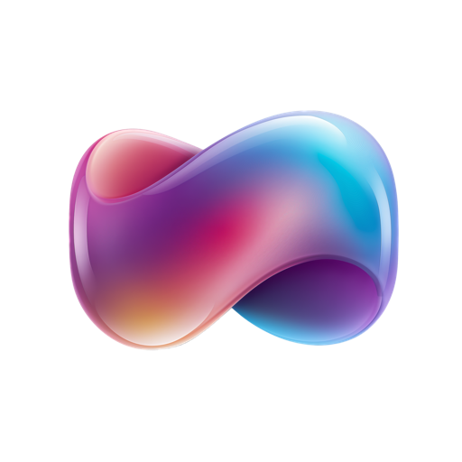
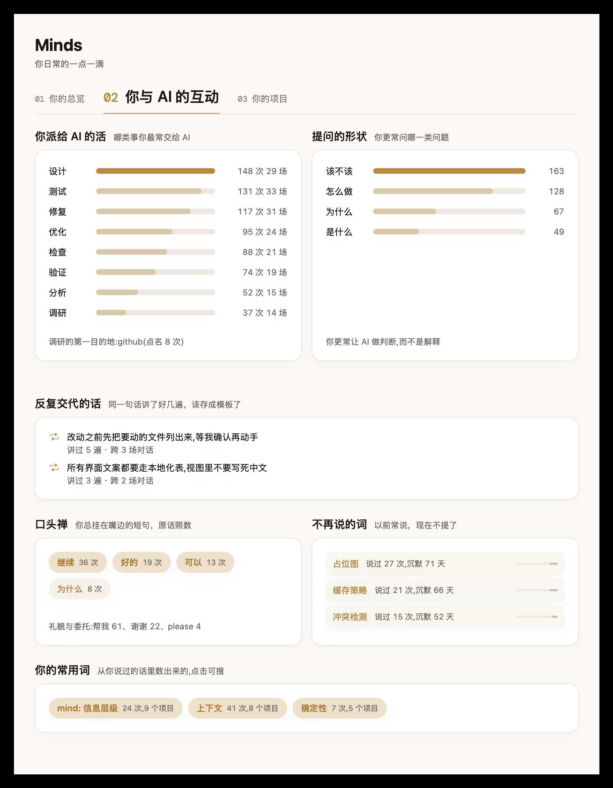
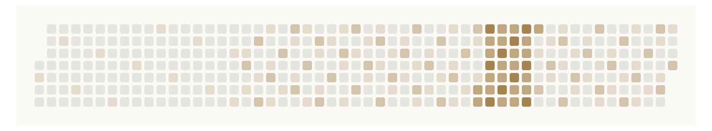

<div align="center">



# MindBus

**把散落在各个 AI 工具里的对话，收进一台机器。**

模型是租的，对话是你的。

无需联网 · 无需账号 · 源码可查

[](LICENSE)
[](#安装)
[](Package.swift)
[-1a1a1a?style=flat-square)](Package.swift)
[](https://github.com/BaoWeiiii/mindbus/actions/workflows/ci.yml)
[](https://github.com/BaoWeiiii/mindbus/releases/latest)

[](#)
[](README.en.md)

[安装](#安装) · [支持的来源](#支持的对话来源) · [隐私](#隐私) · [常见问题](#常见问题) · [参与贡献](#参与贡献)

</div>

---

## 这是什么

**你的 AI 工具记忆收纳箱。**

你可以随时翻阅，收藏；不同的 AI 工具也可以随时调用，低成本获取历史记忆。

你在终端里跑 Claude Code，在 Claude 桌面版里开 Agent 模式，又在 Codex 里写了半天。三个工具，三种记录格式，三个藏在 `~/` 深处的目录。

想找回上周那个决定，只能一个个翻。

MindBus 是一个常驻菜单栏的 macOS App，它把这些对话读进同一个窗口，让你**搜索、翻阅、复制、收藏、接力**到新对话。

在此之上，它把「攒下来的对话」变成看得见的东西：

- **永久留底**——每场对话在本地留有压缩副本。Claude Code 只保留 30 天，这里的永远都在，App 会告诉你有多少场对话已经活过了那 30 天。
- **Minds（思脉）**——从你的对话里数出来的自画像：你最常让 AI 干的活、提问的形状、每个项目的第一句话、断掉的线头、反复回来的问题、你的口头禅、项目之间的知识流动、活跃热力图……26 个小节，每一行都是数出来的，不是生成的（全程零 LLM）。
- **对话报告**——随时生成 1/3/12 个月的统计卡片：哪个工具干了多少活、最忙的一天、你打的字换来了多少产出、你是哪一型。导出前可一键隐去私人内容。
- **删除由你掌控**——对话与单条消息都可删除，二次确认后从 MindBus 的列表、搜索、Minds 里彻底消失（含归档副本），重新扫描也不会回来；但**绝不碰**你工具目录里的原始文件。

它**没有能力**把你的数据发到任何地方——不是「我们承诺不发」，是它根本连不了网。

## 截图

对话浏览器——侧栏按工具聚焦，列表带项目彩签，详情可搜索、收藏、一键接力：


Minds（思脉）——数出来的自画像，有意思的发现置顶（永久留底 / 那年今日 / 断掉的线头…）：



对话报告与活跃热力图：

<p>

</p>


> 以上截图均为内置演示数据。

## 支持的对话来源

App 只读取下面这三个目录，全部是只读访问，不修改原文件：

| 来源 | 读取路径 |
| --- | --- |
| Claude Code | `~/.claude/projects/**/*.jsonl` |
| Claude 桌面版（本地 Agent 模式） | `~/Library/Application Support/Claude/local-agent-mode-sessions/` |
| Codex | `~/.codex/sessions/**/*.jsonl` |

> 注意：你至少得用过其中一个工具——MindBus 收的是「你已经产生的对话」，没有历史数据时它是一间空图书馆。

代码里还躺着 Cursor、OpenClaw、GitHub Copilot 的解析器，暂时没启用——还差足够多的真实样本来验证格式，验完就开放。

## 给 AI 用：MCP Server

App 内置一个只读 MCP server。想让 Claude Code / Codex 用上它，把下面这句话发给你的 AI 就行：

> 把 `/Applications/MindBus.app/Contents/MacOS/mindbus-mcp` 注册成名为 mindbus 的 MCP server

它自己会配好。再往你的 `CLAUDE.md`（或 `AGENTS.md`）里加一条，让 AI 养成先查历史的习惯：

> 涉及过往决定、项目历史或「之前 / 上次」时，先用 mindbus 的 memory_search 查原始对话；新任务开始前用 minds_read 了解我的偏好。

之后你的 AI 就能搜索、翻阅你全部的历史对话，还能读你的思脉画像。除「补充画像」（每条都要注明来源、等你确认）外全部只读——索引以只读方式打开，不可能改动你的库。

检索背后是一套[**记忆换乘协议**](docs/MEMORY-TRANSIT.md)：不保证直达，保证到达——全库任何一场对话最多三次换乘必然可达，全程 ~4K token，比整场注入省两个数量级。

## 隐私

这是这个项目存在的理由。与其写承诺，不如让你自己验证——把仓库拉下来，运行：

```bash
grep -rn "URLSession\|URLRequest" MindBus/
```

**没有任何输出。** 这个 App 发不出任何网络请求：

- **唯一外部依赖是 [Sparkle](https://github.com/sparkle-project/Sparkle)**（自动更新框架，见下）。没有崩溃上报 SDK，没有分析工具。
- **没有账号。** 不用注册、不用登录，也没有地方可以登录。
- **对话不出本机。** 解析和索引都在本地完成，索引是一个 SQLite 文件，存在你自己的磁盘上。
- **只读原始记录。** App 从不修改 AI 工具产生的对话文件。

**唯一的网络功能是更新检查**（Sparkle → GitHub Releases）：默认开启、设置里一键关闭，更新包会先验 EdDSA 签名；发现新版本不弹窗打扰，只在设置顶部亮一条横幅。关掉后 App 完全离线——上面那条 `grep` 依然为空（联网能力在 Sparkle 框架内，不在本仓源码）。

## 安装

### 下载 DMG

从 [Releases](https://github.com/BaoWeiiii/mindbus/releases/latest) 下载 `MindBus-x.y.z.dmg`（Universal，Apple Silicon 与 Intel 通用），打开后把 MindBus 拖进「应用程序」。

DMG 已由 Apple Developer ID 签名并公证，双击即开。

### 从源码构建

```bash
git clone https://github.com/BaoWeiiii/mindbus.git
cd mindbus
swift build -c release
./scripts/build-release.sh        # 打包成 MindBus.app（加 --dmg 可产出 DMG）
```

需要 Xcode 15+ / Swift 5.9+，macOS 13.0 或更高。自己构建的 App 没有隔离标记，不会被 Gatekeeper 拦截。

## 开发

```
MindBus/
├── Core/          # MindBusCore — 解析与索引，纯逻辑，可独立测试
│   ├── Loaders/   # 各工具的 JSONL 解析器
│   ├── DB/        # SQLite 增量索引
│   ├── Markdown/  # 正文分段与代码块识别
│   └── Models/    # Conversation / Message / ContentBlock
├── Views/         # SwiftUI 界面（菜单栏面板 / 对话浏览器 / 设置）
└── Config/        # 设计 token 与 Native Messaging（本地 IPC，非网络）
```

解析逻辑全部收在 `MindBusCore` 这个 library target 里，不依赖 SwiftUI，所以能脱离界面单独测试：

```bash
swift test          # 800+ 个测试,全绿是合并的底线
```

加一个新的对话来源，通常就是写一个 Loader + 一组测试，参考 [`CodexLoader.swift`](MindBus/Core/Loaders/CodexLoader.swift)。

## 常见问题

**打开后是空的?**
MindBus 收录的是「你已经产生的对话」。它不联网、没有云端,所以至少用过一次 Claude Code / Claude 桌面版 / Codex,库里才有东西。

**删除对话会影响原始文件吗?**
不会。删除只从 MindBus 里抹除(列表、搜索、Minds、归档副本),你工具目录里的原始记录**从未被碰过**——这是写进测试里的底线,每条删除用例都断言源文件仍在。

**Minds 里的内容是 AI 生成的吗?**
不是。每一行都是从你的对话里**数出来**的(次数、日期、会话数皆可回查),全程零 LLM。AI 只在一个地方出现:MCP 的 `minds_enrich` 允许宿主模型补充画像,但每条都强制溯源、默认待你确认。

**什么时候支持 Cursor / Copilot?**
解析器已经写好在仓库里,差的是足够多的真实格式样本做验证。欢迎在 Issue 里提供样本(脱敏后的结构示例即可)。

## 参与贡献

欢迎 Issue 与 PR,中文英文皆可。几条约定:

- **测试全绿是硬门槛**——`swift test` 通过再提 PR;改动解析器或索引口径的,请附上对应测试。
- **新增对话来源**是最受欢迎的贡献:写一个 Loader + 一组测试即可接入全部管线(搜索/Minds/归档),参考 [`CodexLoader.swift`](MindBus/Core/Loaders/CodexLoader.swift)。
- **零外部依赖**是项目底线(唯一例外 Sparkle)——引入新依赖的 PR 请先开 Issue 讨论。

## 卸载

数据主权也包括「干净地离开」。MindBus 在你磁盘上只有两处：

```bash
rm -rf /Applications/MindBus.app
rm -rf ~/Library/Application\ Support/MindBus     # 本地索引（可从源文件随时重建）
```

「登录项」里的开机自启随 App 删除自动失效。你的原始对话记录（`~/.claude` 等）从未被修改，卸载不影响它们。

## 许可证

[MIT](LICENSE)
